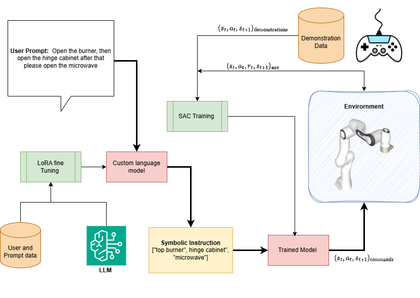

# Autonomous-Robot-LLM-DRL

Autonomous robotic manipulation framework combining teleoperation data, deep reinforcement learning (SAC), and Large Language Models (LLMs) to enable sequential and multitask execution from natural language instructions in household environments, such as kitchen tasks.


---

## **Project Overview**

This project aims to create a pipeline for interactive and autonomous robots that can:

1. Learn **individual atomic tasks** from teleoperation data using **deep reinforcement learning (SAC)**.
2. Execute **sequences of tasks** (multitask execution) based on **natural language instructions**.
3. Integrate **Large Language Models (LLMs)** to translate human prompts into executable task sequences.

The workflow connects **human demonstrations → DRL training → LLM task specification → sequential execution**.

---

## **Folder Structure**

- `microwave/`, `top_burner/`, `hinge_cabinet/`, … : Individual atomic tasks trained separately.  
- `LLM/`: Training scripts for the **LLaMA model**, including LoRA fine-tuning for task sequence generation.  
- `sentence_embedding/` : Training scripts for **sentence transformer models** to encode natural language instructions.  
- `videos/`: Generated visualizations (optional).    

---

## **Main Inference / Execution**

The **primary entry point** for running multitask execution with the LLM and SAC policies is:

```bash
python test_multitask_1b.py
